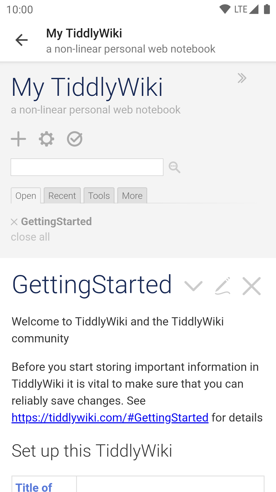

# Tiddloid Lite

&ensp;&ensp;&ensp;&ensp;&ensp;&ensp;&ensp;&ensp;&ensp;

Tiddloid Lite, a lightweight version of [Tiddloid](https://github.com/donmor/Tiddloid), is an app to work with locally stored TiddlyWikis. Once have some ideas, you can immediately write them down and save it in a tiddler, and sync the Wiki to your other devices so that you can access these ideas anywhere.

&emsp;&emsp;

See https://tiddlywiki.com/ for more details of TiddlyWiki.

### Discontinuance Announcement

There will be no feature updates since version 1.2.0, because all unique features have been merged into version 2.0.0 of [Tiddloid](https://github.com/donmor/Tiddloid). However, it'll still be updates for bug fixes for Tiddloid Lite, and it will remain LITE.

### Features

* Create new Wikis with latest template
* Import existing Wikis from file providers, supporting local and cloud.
* Saving TiddlyWikis to the source file by clicking the Save button
* Creating shortcuts to existing wiki on desktop
* Importing or exporting wiki list data

### Frequently Asked Questions

* I can't find where to importing/exporting wiki list data.

    The wiki list importing/exporting are hidden features since it's seldom used.

    * To import: Copy `data.json` to `INTERNAL/Android/data/top.donmor.tiddloidlite/files/` before running for the first time. If you have previously run the program, clear the data in `Settings/Apps` and copy the file.
    * To export: Create a tiddler with: `<a href="javascript:window.twi.exportDB()">export</a>` and click the link. A `data.json` will be generated under `INTERNAL/Android/data/top.donmor.tiddloidlite/files/`.

* How to apply UI tweaks?

    Install the plugin provided along with the apk and: 

    * Apply theme color: Check `Control Panel/Appearance/Tiddloid Tweaks/Apply theme color to system bars`.
    * Hide toolbar: Check `Control Panel/Appearance/Tiddloid Tweaks/Hide toolbar on loading complete`.

* I encountered a Javascript error followed by a white screen in newly created files.

    * Check your Android version. TiddlyWiki 5.1.23 has critical bugs on Android 5.1 and below (WebView 39). A solution is to get a pre-release version of TiddlyWiki, which have had this bug fixed or, a previous version without this bug.

* My wiki list change its order randomly every time.

    * Check your Android version. One of the functions in the JSON library behaves differently below 4.4, causing random wiki list order bug on KitKat devices. We recommend you to use Tiddloid on Oreo (8.0) and above to enable all of its features.

* Why there's a Tiddloid Lite? What's the difference between this and Tiddloid?

    In the past 1.x days, Tiddloid use legacy `file://` ways to handle files, causing the lack of access to cloud medias. Later I made another branch that implements Android's SAF (i.e. Storage Access Framework), and finally it became a lightweight version. Now since Tiddloid 2.0 has been refactored to use SAF, this project has been discontinued except for bug fixes.

    Here's the difference between different versions:

    | Feature                                   | [Tiddloid](https://github.com/donmor/Tiddloid) 1.x | [Tiddloid](https://github.com/donmor/Tiddloid) 2.0 and above | Tiddloid Lite |
    | ----------------------------------------- | ------------- | ------------------------------------------------------------ | -------------------------------- |
    | File API                                  | Java File API | Android Storage Access Framework and also Java File API      | Android Storage Access Framework |
    | Backup system                             | Yes           | Yes                                                          | No                               |
    | Search-and-Fork system                    | Yes           | No (Instead it receives shared URLs from browsers and show options to save the page) | No                               |
    | Downloader                                | Yes           | No                                                           | No                               |
    | Direct access to files in the same folder | Yes           | Partial (Legacy, or TiddlyWiki folders by caching all files) | No                               |
    | Cloud Service                             | No            | Yes (via SAF)                                                | Yes (via SAF)                    |
    | Template | Download on first startup | Download on creating new wiki, and cached in case it is unable to access the Internet |Download on creating new wiki|
    | Compatibility | Supports most of Android versions and most of TiddlyWikis | Supports latest Android versions best and supports most of TiddlyWikis |Supports latest Android versions best and supports most of TW5|
    | Recommended Android version | Android 4.4 ~ 9.0 | Android 4.4 and above, best for 8.0 and above |Android 4.4 and above, best for 8.0 and above|

### License

This app is released under GPL v2 license,
1. Commercial use
2. Modification
3. Distribution
4. Private use

is permitted UNDER THESE CONDITIONS:
1. Provide this license and copyright notice
2. State changes
3. Disclose source under
4. Same license.

This app is made possible with the help of these open source projects:
* Json - https://json.org/ ,
* Jsoup - https://jsoup.org/ ,

License files provided in /lic.

### Localization

The localization of this app is currently provided by Google Translation. Pull requests are welcomed if you have better localization.

### About us

Thank you for trying donmor's productions. I'd really appreciate it if you kindly support us via the buttons below, and take more effect to improve our productions.

&ensp;&ensp;&ensp;&ensp;

If you take an interest in us, fell free to visit [our homepage](https://donmor.top/).
